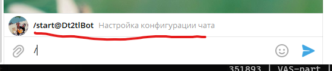

# tl;dr
Тебе когда-нибудь приходилось кидать в чат ссылку на PR и просить кого-нибудь его посмотреть, 
а никто его не смотрел? Нам приходилось) Из этого кейса родилась идея простого бота, определяющего 
кто будет ревьюить твой реквест.

Как это работает?

Приглашаешь в любой чат, где есть разработчики бота **@Dt2tlBot**
Запускаешь процесс настройки командой **/start**
Добавляешь нужное количество команд
Каждый разработчик вступает в свою команду
Сохраняешь конфигурацию
Теперь любой разработчик может кинуть ссылку на пулл-реквест со знаком восклицания в начале, 
а бот подберет ему ревьюеров, согласуясь с нашим правилом 2-х лайков:

* 1 ревьюер из той же команды, что и автор реквеста
* 1 ревьюер из любой другой команды  

Теперь остановимся на каждом пункте подробнее

# Подключение бота
Добавляем бота в наш чат  
  
  
Бот с нами в чате, можем приступать к настройке

# Настройка бота

## Запуск процесса настройки
Открываем панель команд
  
Кликаем  
  
Видим окно приветствия бота. По умолчанию конфигурация содержит одну пустую команду по умолчанию - **DevTeam**

## Добавляем нужное количество команд
Добавить команду можно ответными сообщением (Reply) с названием команды. Имя команды не должно превышать _16 символов._

Команду по умолчанию можно удалить, нажав на кнопку Удалить "DevTeam"
  
  
По аналогии можем добавить команд столько, сколько нужно. Переходим к распределению разработчиков по командам

## Распределяемся по командам
Нажимаем на **Перейти к выбору команд**
  
В зависимости от количества команд, которые вы добавили будет отображаться соответствующее количество кнопок 
**Вступить в "..."**.  
  
Нажимаем на нужную, что добавляет нас в команду  
  
  

## Отменить изменения в конфигурации (опциональный шаг)
Если что-то пошло не так, то всегда можно откатить текущие и ничего не сохранять. Нажимаем на **Отменить изменения**
  
Бот удалит сообщение и сбросит изменения
  
Чтобы начать конфигурацию заново, снова выполняем команду **/start**

## Сохранить настройки
Чтобы изменения вступили в силу, сохраняем изменения кнопкой **Сохранить конфигурацию**  
  
Бот сохранит конфигурацию и выведет ее на экран  
  

## Отправляем ссылку на PR
Ссылка отправляется в текстовом сообщении со знаком восклицания перед ней. В ответ бот пришлет нотификацию 
для выбранных ревьюеров  
  

## Early alpha
Бот хостится на Heroku на бесплатном аккаунте, поэтому имеет рабочий режим дня: **пн-пт с 10-00 до 20-00 по МСК**

В настоящий момент бот находится на стадии альфа-теста. Поэтому все что угодно может пойти не плану, уж простите.

В случае возникновения вопросов, обращайтесь к **@gtjbtits** в Telegram. Постараюсь помочь

Ссылка на проект: https://github.com/gtjbtits/dt2tl. Заведение Issues приветствуется
